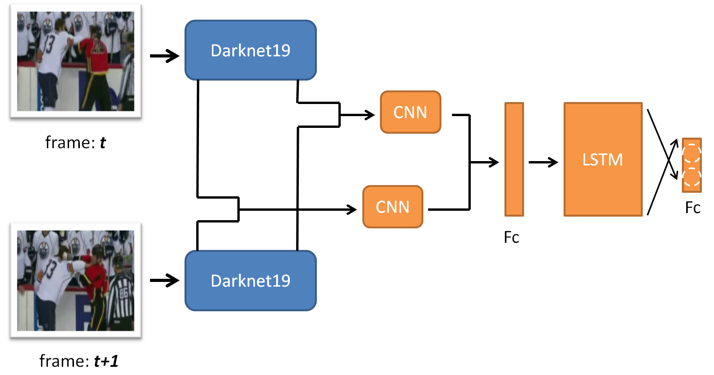

# Violence Detection by CNN + LSTM
  The proposed approach outperforms the state-of-the-art methods, while still processing the videos in real-time.
The proposed model has the following advantages:
1. The ability to use the pre-trained model on ImageNet dataset.
2. The ability to learn the local motion features by examined the concatenated two frames using CNN.
3. The ability to learn the global temporal features by LSTM cell.

For more information, please refer to [this article](http://joshua-p-r-pan.blogspot.tw/2018/05/violence-detection-by-cnn-lstm.html).

## Requirement
Python3

sk-video

scikit-image

TensorFlow 1.7.0

[imgaug](https://github.com/aleju/imgaug)
(This pakage has already contained in src/third_party)


## Quick Start
### Training
1. Download the fight/non-fight dataset from [here](http://visilab.etsii.uclm.es/personas/oscar/FightDetection/index.html)
   or, other fight/non-fight datasets is also supported as long as you separate the fight and non-fight videos
   in the different directories.

2. To make the data catelogs that will tell the data manager where to load the videos, edit the file:
   tools/Train_Val_Test_spliter.py to specified the path to the dataset videos, the ratio to split the datasets into training,
   validation and test set.  And run such scripts, you will get three data catelogs: train.txt, val.txt, test.txt.

3. Edit the settings/DataSettings.py to specify where do you put the data catelogs:
```Shell
	PATH_TO_TRAIN_SET_CATELOG = 'MyPathToDataCatelog/train.txt'
	PATH_TO_VAL_SET_CATELOG = 'MyPathToDataCatelog/val.txt'
	PATH_TO_TEST_SET_CATELOG = 'MyPathToDataCatelog/test.txt'
```

4. Edit the settings/TrainSettings.py, and set the variables to fit your environment.  For example, you may want to edit
    the following variables:
```Shell
	MAX_TRAINING_EPOCH = 30

	EPOCHS_TO_START_SAVE_MODEL = 1
	PATH_TO_SAVE_MODEL = "MyPathToSaveTrainingResultsAndModels"
```

5. You're ready to train the model.  Type the following command to train:
```Shell
	python3 Train.py
```
   or, if you set the Train.py to be executable, just type:
```Shell
	./Train.py
```

### Deploy
After you have trained a model, you can input a video and see its performance by following procedures:
1. Edit the settings/DeploySettings.py to set the variables to fit your environment.  For example, you may want to edit
   the following variables:
```Shell
	PATH_TO_MODEL_CHECKPOINTS = "PathToMyBestModelCheckpoint"
```

## Architecture and Design Philosophy
1. This project has the following architecture:

   * Train.py: An executable that can train the violence detection models.

   * Deploy.py: An executable that can display a video and show if it has violence event per frame.

   * Evaluate.py: An executable that can calculate the accuracies with respect to the given dataset catelog and the
                  model checkpoints.

   * settings/:   A folder that contains various settings in this projects.  Most of the commonly changed variables can
                be found here.  If prefer this design philosophy because the user can easily change several variables
                without get into the source code.  Moreover, to isolate the customized variables here, this folder can
                be set as ignored by git if there're multiple developers to avoid the conflicts.  Although one can also
                use the tf.app.flags to avoid the conflicts between the developers, I think it's kind of pain to enter
                so much arguments in the command line.

   * src/: Functions and Classes that used by the executables can be found here.

       * src/data: Libraries that deal with data.

       * src/layers: Convinient functions or wrappers for tensorflow.
                     Note: The settings of layers (such as weight decay, layer initailization variables) can be found in
                           settings/LayerSettings.py.

       * src/net: The network blueprints can be found here.  You can find examples and design your own networks here.
                  Note: Remember to change the new-developed network by editting the settings/NetSettings.py.

       * src/third_party: Third-party libraries are placed here.  Currently, this folder only contains the data augmentation
                          library: [imgaug](https://github.com/aleju/imgaug).
